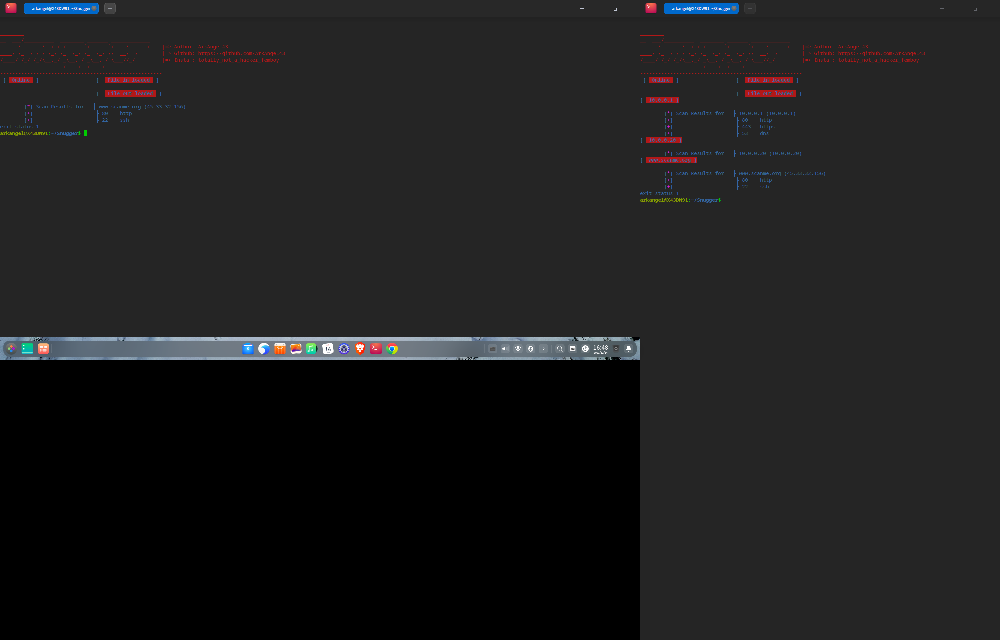

# Snugger
```
________                                          
__  ___/__________  ________ _______ _____________
_____ \__  __ \  / / /_  __ `/_  __ `/  _ \_  ___/    |=> Author: ArkAngeL43
____/ /_  / / / /_/ /_  /_/ /_  /_/ //  __/  /        |=> Github: https://github.com/ArkAngeL43
/____/ /_/ /_/\__,_/ _\__, / _\__, / \___//_/         |=> Insta : totally_not_a_hacker_femboy
                     /____/  /____/                   
------------------------------------------------------
[ online ]                        [ file IN loaded ]  
                                  [ file OUT loaded ]
```
Snugger is a light weight but fast network recon scanner that is written from pure golang. with this scann you can ARP your network, port scan hosts and host lists, as well as scan for BSSId


# commands or flags that will/can be parsed 

```
SCAN HOSTS THROUGH LIST MODULE 

sudo go run main.gp -portl -list <path to hostname file>

SINGLE HOST SCANNING MODULE

sudo go run main.go -port -host < host IP > 

ARP MODULE

sudo go run main.go -arp


WIFI FINDER/BSSID MINER MODULE

sudo go run main.go -wifi


breif/advanced description of what this script does 


it can run 

port scanning through lists and individual hosts such as 

domains, private and public hostnames, even networks.

Adress Resolution Protocal scripts to call all IPADDR's on the networks
and find their BSSID

send out beacon frames to find a networks BSSID

---- but i dont see any output when wifi scanning?

all of it goes in the file `in.txt` and is redirected to out.txt

all information gathered from any module is logged there
```
operating systems tested on: windows, parrot OS, debian, deepin 

# port scanning modules demo



  
